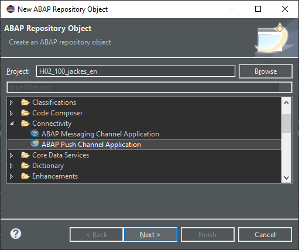
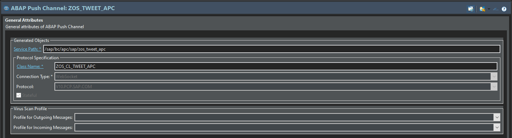
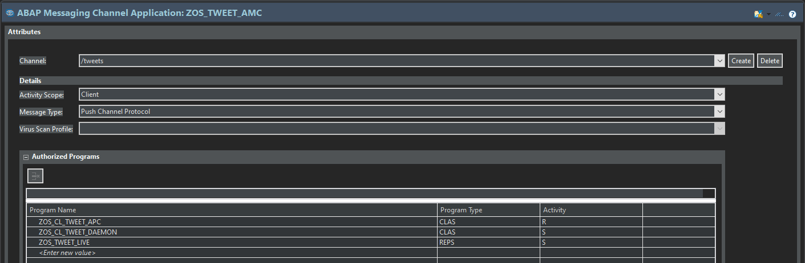

<!-- .slide: data-background="./img/meetup-logo.png" -->

<h1 class="fragment fade-in" style="color: #000;">Willkommen!</h1>

---

# Webentwicklung goes SAP

**Volume 2**: WebSockets & ABAP Messaging Channels

---

## Agenda

- SAPUI5 / OpenUI5
- WebSockets
- ABAP Messaging Channels
- ABAP Daemons
- Code-Beispiel

---

## Was ist SAPUI5?

- UI-Framework von SAP
- Basiert auf HTML5, CSS, jQuery und Bootstrap
- Open Source: [OpenUI5](https://github.com/SAP/openui5)

---

### Klassische Webentwicklung

```html
<div id="container" data-sap-ui="container">
  <div id="container-uiarea" style="height: 100%;">
    <div id="container-cart---app">
      <div id="container-cart---app--app">
        <div id="container-cart---app--app-BG" class="sapMAppBG">
```

---

### SAPUI5

```xml
<Page
    title="Twitter-Feed mit UI5">
    <ScrollContainer>
        <List items="{feed>/}">
            <FeedListItem
                sender="{feed>username}"
                icon="{feed>img}"
                info="{feed>info}"
                text="{feed>text}"
                iconPress=".showProfileDetails">
            </FeedListItem>
        </List>
    </ScrollContainer>
</Page>
```

<span class="fragment" data-code-focus="2"></span>
<span class="fragment" data-code-focus="4-12"></span>
<span class="fragment" data-code-focus="5-11"></span>

-----

### Data Binding

```json
[
  {username: "Patrick Jackes", text: "#AbapIsNotDead", icon: "https://..."},
  {username: "gicom", text: "#AbapIsNotDead", icon: "https://..."},
  {username: "Daniel Schmitz", text: "#AbapIsNotDead", icon: "https://..."}
  ...
]
```

<span class="fragment">Kein manuelles Setzen von Properties notwendig</span>

---

## WebSockets

> Technologie, mit der interaktive Kommunikations-Sessions zwischen dem Browser 
des Benutzers und dem Server hergestellt werden können 

<span style="font-size: 50%">Quelle: [MDN](https://developer.mozilla.org/de/docs/WebSockets)</span>

<span class="fragment">🠊 Nachrichten ereignisorientiet senden und erhalten
</span>

---


<span style="font-size: 50%">Quelle: [resellerspanel](https://blog.resellerspanel.com/hepsia-control-panel/supervisor-run-background-processes.html/attachment/websocket-scheme)</span>

---

### Praxisbeispiele

- Online-Spiele mit mehreren Mitspielern (Agar.io)
- Chat-Anwendungen
- Live-Sport-Ticker

---

## ABAP Messaging Channels

---

- Kommunikation zwischen **ABAP-Programmen** über **Nachrichten**
- **Publish**- & **Subscribe**-Mechanismus
- **Berechtigungssteuerung** pro Anwendung

💡 Verfügbar (produktiv) ab NW AS ABAP 7.40 SP5

---

### Nachrichtentypen:

- `TEXT`: Strings
- `BINARY`: Binärstrings
- `PCP`: **P**ush **C**hannel **P**rotocol

---

### Vorteile von PCP

- Kopfdaten & Nachrichtenkörper
- *Multiplexing in UI5 über optionalen Parameter*

👉 **Empfehlung von SAP**

---

Andere Objekte über Serialisierung:

```abap
DATA(lv_string) = /ui2/cl_json=>serialize( ls_structure ).
```

❗ Maximale Nachrichtenlänge ca. 1 MB

---

### Wofür?

Kommunikation zwischen verschiedenen **Benutzersitzungen** und **Applikationsservern**.

👉 Zum Beispiel beim Einsatz von **ABAP Daemons**.

---

## ABAP Daemons

👹

---

### Daemons in UNIX

> Als Daemon oder Dämon bezeichnet man unter Unix oder unixartigen Systemen ein Programm, das im Hintergrund abläuft und bestimmte Dienste zur Verfügung stellt.

<span style="font-size: 50%">Quelle: [Wikipedia](https://de.wikipedia.org/wiki/Daemon)</span>

---

### Daemons in SAP

💡 **A**BAP **D**aemon **F**ramework (ADF)

Instanzen von Klassen, die in speziellen **ABAP-Daemon-Sitzungen** leben und auf **ABAP-Daemon-Ereignisse** reagieren.

---

```abap
CLASS zcl_my_daemon DEFINITION PUBLIC
  INHERITING FROM cl_abap_daemon_ext_base.
    PUBLIC SECTION.
      METHODS:
        if_abap_daemon_extension~on_error REDEFINITION,
        if_abap_daemon_extension~on_message REDEFINITION,
        if_abap_daemon_extension~on_restart REDEFINITION,
        if_abap_daemon_extension~on_server_shutdown REDEFINITION,
        if_abap_daemon_extension~on_accept REDEFINITION,
        if_abap_daemon_extension~on_start REDEFINITION,
        if_abap_daemon_extension~on_stop REDEFINITION,
        if_abap_daemon_extension~on_system_shutdown REDEFINITION,
        if_abap_daemon_extension~on_before_restart_by_system REDEFINITION.
ENDCLASS.
```

---

- Lebenszeit von ABAP Daemon = Lebenszeit von AS ABAP
- Stoppen nur durch ADF, z. Bsp. mit `SMDAEMON`
- **Automatischer Neustart** bei Laufzeitfehlern

---

ABAP Daemons laufen im sog. **Non-Blocking-Modus**

❗ Verbot von Anweisungen, die den Programmablauf blockieren, z. Bsp. `WAIT`

👉 ABAP Timers (`IF_ABAP_TIMER_HANDLER`)

---

### Wofür?

ABAP Daemons sind **langlebige** und **zuverlässige** Ereignisbehandler.

- Ereignisplaner für IoT (Message Queueing)
- Hintergrundaufgaben (z. Bsp. Logging)
- Einfache periodische Aufgaben (z. Bsp. Health Checks)
- Integration mit **MQTT**

---

## Das Beispiel

---

🦜 **Twitter mit SAPUI5 & ABAP**

- Live-Feed mit SAPUI5
- ABAP Push Channel für WebSocket-Verbindung
- ABAP Daemon "twittert" aus der Datenbank

---

### Frontend mit UI5

```javascript
const sUrl = "...";

const oWebSocket = new WebSocket(sUrl);

oWebSocket.attachMessage(oEvent => {
    console.log("Got message");

    const oTweet = JSON.parse(oEvent.getParameter("data"));
    this.handleTweet(oTweet);
});
```
<span class="fragment" data-code-focus="1"></span>
<span class="fragment" data-code-focus="3"></span>
<span class="fragment" data-code-focus="9"></span>

---

`ws://[USERNAME]:[PASSWORD]@[HOST]:[PORT]/sap/bc/apc/sap/[APC_NAME]`

---

### Der ABAP Push Channel

---

ABAP Push Channel werden als **eigene Repository-Objekte** gepflegt.



---



---

```abap
CLASS zos_cl_tweet_apc DEFINITION PUBLIC
  INHERITING FROM cl_apc_wsp_ext_stateful_pcp_b.
  PUBLIC SECTION.

    METHODS:
      if_apc_wsp_ext_pcp~on_message REDEFINITION,
      if_apc_wsp_ext_pcp~on_start REDEFINITION.

ENDCLASS.
```

<p class="fragment" data-code-focus="2">Super-Klasse steuert statefulness & Protokoll</p>

---

#### ON_MESSAGE

- Wird aufgerufen, sobald eine Nachricht im Push Channel empfangen wird
- Nachricht und Nachrichtenmanager als Parameter

---

```abap
METHOD if_apc_wsp_ext_pcp~on_message.
* We just play ping pong
  TRY.
      DATA(lo_pcp) = i_message_manager->create_message( ).
      lo_pcp->set_text( i_message->get_text( ) ).

      i_message_manager->send( lo_pcp ).

    CATCH cx_apc_error cx_ac_message_type_pcp_error.
*     :(

  ENDTRY.
ENDMETHOD.
```

<p class="fragment fade-in-then-out" data-code-focus="4,5">Antwortnachricht erzeugen...</p>
<p class="fragment fade-in-then-out" data-code-focus="7">... und zurücksenden.</p>

---

### Der ABAP Messaging Channel

---

ABAP Messaging Channel werden als **eigene Repository-Objekte** gepflegt.


---



---

#### Beispielanwendung für AMC

- Sendet eine Nachricht auf dem Messaging Channel
- ABAP Push Channel reagiert auf Nachricht
  - **Weiterleiten** an den WebSocket

---

```abap
DATA(ls_tweet) = VALUE zos_cl_tweets=>gst_tweet(
  text      = p_text
  user      = VALUE #(
    name        = p_user
    screen_name = p_name
  )
).

DATA(lv_json) = /ui2/cl_json=>serialize(
  pretty_name = /ui2/cl_json=>pretty_mode-low_case
  data        = ls_tweet
).
```

<p class="fragment fade-in-then-out" data-code-focus="1-7">Tweet aus Parametern erzeugen...</p>
<p class="fragment fade-in-then-out" data-code-focus="9-12">... und als JSON-String serialisieren.</p>

---

```abap
TRY.
    DATA(lo_pcp) = cl_ac_message_type_pcp=>create( ).
    lo_pcp->set_text( lv_json ).

    CAST if_amc_message_producer_pcp( cl_amc_channel_manager=>create_message_producer(
      i_application_id = 'ZOS_TWEET_AMC'
      i_channel_id     = '/tweets'
    ) )->send( lo_pcp ).

  CATCH cx_amc_error  cx_ac_message_type_pcp_error INTO DATA(lo_ex).
    MESSAGE lo_ex->get_text( ) TYPE 'E'.
ENDTRY.
```

<p class="fragment fade-in-then-out" data-code-focus="2-3">PCP Nachricht erzeugen...</p>
<p class="fragment fade-in-then-out" data-code-focus="5-8">... und an den AMC schicken.</p>

---

Implementierung im ABAP Push Channel:

```abap
CLASS zos_cl_tweet_apc DEFINITION PUBLIC
  INHERITING FROM cl_apc_wsp_ext_stateful_pcp_b.
  PUBLIC SECTION.
    DATA go_message_manager TYPE REF TO if_apc_wsp_message_manager_pcp.

    INTERFACES if_amc_message_receiver_pcp.

    METHODS:
      if_apc_wsp_ext_pcp~on_message REDEFINITION,
      if_apc_wsp_ext_pcp~on_start REDEFINITION.
ENDCLASS.
```

<p class="fragment fade-in-then-out" data-code-focus="6">Neues Interface hinzufügen</p>
<p class="fragment fade-in-then-out" data-code-focus="4">Neues Feld, um Nachrichtenmanager zu speichern</p>

---

Implementierung von **on_start**:

```abap
METHOD if_apc_wsp_ext_pcp~on_start.
  me->go_message_manager = i_message_manager.

  TRY.
      cl_amc_channel_manager=>create_message_consumer(
        i_application_id = 'ZOS_TWEET_AMC'
        i_channel_id     = '/tweets'
      )->start_message_delivery( me ).

    CATCH cx_amc_error.

  ENDTRY.
ENDMETHOD.
```

<p class="fragment fade-in-then-out" data-code-focus="2">Nachrichtenmanager speichern</p>
<p class="fragment fade-in-then-out" data-code-focus="5-8">Abonnieren des AMC</p>

---

Empfangen der AMC-Nachricht:

```abap
METHOD if_amc_message_receiver_pcp~receive.
  TRY.
      DATA(lo_pcp) = me->go_message_manager->create_message( ).
      lo_pcp->set_text( i_message->get_text( ) ).

      me->go_message_manager->send( lo_pcp ).

    CATCH cx_apc_error cx_ac_message_type_pcp_error.

  ENDTRY.
ENDMETHOD.
```

<p class="fragment fade-in-then-out" data-code-focus="3-4">Empfangene AMC-Nachricht für den Push-Channel vorbereiten</p>
<p class="fragment fade-in-then-out" data-code-focus="6">Absenden der Nachricht durch den Push-Channel</p>

---

<div style="font-weight: bold; font-size: 200%;">Live-Demo Teil 1</div>

---

<!-- .slide: data-background-iframe="http://localhost:8081/" data-background-interactive="true" -->

---

### Der ABAP Daemon

---

```abap
CLASS zos_cl_tweet_daemon DEFINITION PUBLIC
  INHERITING FROM cl_abap_daemon_ext_base.
    PUBLIC SECTION.
      METHODS:
        if_abap_daemon_extension~on_error REDEFINITION,
        if_abap_daemon_extension~on_message REDEFINITION,
        if_abap_daemon_extension~on_restart REDEFINITION,
        if_abap_daemon_extension~on_server_shutdown REDEFINITION,
        if_abap_daemon_extension~on_accept REDEFINITION,
        if_abap_daemon_extension~on_start REDEFINITION,
        if_abap_daemon_extension~on_stop REDEFINITION,
        if_abap_daemon_extension~on_system_shutdown REDEFINITION,
        if_abap_daemon_extension~on_before_restart_by_system REDEFINITION.
ENDCLASS.
```

<span class="fragment fade-in-then-out" data-code-focus="9,10">Diese Methoden werden implementiert</span>

---

#### ON_ACCEPT

- Wird vor dem Start des Daemons ausgeführt
- Bestimmt, ob der Daemon gestartet werden soll

👉 Berechtigungsprüfung, etc.

---

```abap
METHOD if_abap_daemon_extension~on_accept.
  TRY.
      DATA(lv_my_program_name) = cl_oo_classname_service=>get_classpool_name( 
        zos_cl_tweet_daemon=>cv_name 
      ).
      IF i_context_base->get_start_caller_info( )-program = lv_my_program_name.
        e_setup_mode = co_setup_mode-accept.
      ELSE.
        e_setup_mode = co_setup_mode-reject.
      ENDIF.

    CATCH cx_abap_daemon_error.
      e_setup_mode = co_setup_mode-reject.
  ENDTRY.
ENDMETHOD.
```

<p class="fragment fade-in-then-out" data-code-focus="7">Start des Daemons zulassen...</p>
<p class="fragment fade-in-then-out" data-code-focus="9,13">oder verweigern.</p>

---

#### ON_START

- Wird beim Start das ABAP Daemons aufgerufen
- Initialisierung des Daemons
  - Anbindung an **ABAP Messaging Channels**
  - Erzeugen von **ABAP Timers**

---

```abap
METHOD if_abap_daemon_extension~on_start.
  TRY.
      me->gv_tweets_left = i_context->get_start_parameter( )->get_field( 'tweets' ).

      me->go_timer = cl_abap_timer_manager=>get_timer_manager( ).

      me->go_timer->start_timer(
        i_timeout       = 100
        i_timer_handler = me
      ).

    CATCH cx_abap_daemon_error cx_abap_timer_error cx_ac_message_type_pcp_error.
  ENDTRY.
ENDMETHOD.
```

<p class="fragment fade-in-then-out" data-code-focus="3">Auslesen von Start-Parametern</p>
<p class="fragment fade-in-then-out" data-code-focus="5,7-10">Starten eines ABAP Timers</p>

---

#### ON_TIMEOUT

Implementieren des **ABAP Timer**-Handlers:

```abap
CLASS zos_cl_tweet_daemon DEFINITION PUBLIC
  INHERITING FROM cl_abap_daemon_ext_base.
    PUBLIC SECTION.
      INTERFACES if_abap_timer_handler.

      METHODS:
*       ...
        .
ENDCLASS.
```

<p class="fragment fade-in-then-out" data-code-focus="4">Neues Interface</p>

---

Senden eines Tweets bei Timeout:

```abap
METHOD if_abap_timer_handler~on_timeout.
  ASSIGN me->gt_tweets[ me->go_random_tweets->get_next( ) ] TO FIELD-SYMBOL(<ls_tweet>).
  DATA(ls_tweet) = zos_cl_tweets=>convert_to_external( <ls_tweet> ).
  DATA(lv_json) = /ui2/cl_json=>serialize(
    data        = ls_tweet
    pretty_name = /ui2/cl_json=>pretty_mode-low_case
  ).

*   ...

  me->gv_tweets_left = me->gv_tweets_left - 1.
  IF me->gv_tweets_left > 0.
    me->start_timer( ).
  ENDIF.
ENDMETHOD.
```

<p class="fragment fade-in-then-out" data-code-focus="2-7">Zufälligen Tweet von Tabelle holen und serialisieren</p>
<p class="fragment fade-in-then-out" data-code-focus="11-14">Timer erneut starten falls notwendig</p>
<p class="fragment fade-in-then-out" data-code-focus="9"></p>

---

Gelesenen Tweet über AMC an den Push Channel schicken:

```abap
TRY.
    DATA(lo_pcp) = cl_ac_message_type_pcp=>create( ).

    lo_pcp->set_text( lv_json ).

    CAST if_amc_message_producer_pcp( cl_amc_channel_manager=>create_message_producer(
      i_application_id = 'ZOS_TWEET_AMC'
      i_channel_id     = '/tweets'
    ) )->send( lo_pcp ).

  CATCH cx_amc_error cx_ac_message_type_pcp_error.

ENDTRY.
```

---

#### Starten des Daemons

- Start über `CL_ABAP_DAEMON_CLIENT_MANAGER`
- Parameter über initiale **PCP**-Nachricht

---

```abap
METHOD start.
  DATA(lo_pcp) = cl_ac_message_type_pcp=>create( ).

  lo_pcp->set_field(
    i_name  = 'tweets'
    i_value = CONV #( iv_tweets )
  ).

  cl_abap_daemon_client_manager=>start(
    i_class_name = zos_cl_tweet_daemon=>cv_name
    i_name       = CONV #( iv_name )
    i_priority   = cl_abap_daemon_client_manager=>co_session_priority_low
    i_parameter  = lo_pcp
  ).
ENDMETHOD.
```

<p class="fragment fade-in-then-out" data-code-focus="2,4-7">Erzeugen der PCP-Nachricht</p>
<p class="fragment fade-in-then-out" data-code-focus="9-14">Starten des Daemons</p>

---

<div style="font-weight: bold; font-size: 200%;">Live-Demo Teil 2</div>

---

<!-- .slide: data-background-iframe="http://localhost:8081/" data-background-interactive="true" -->

---

## Und sonst?

---

### Klassische Programme

```abap
WAIT FOR MESSAGING CHANNELS
    UNTIL lo_receiver->pcp_message IS BOUND
    UP TO 10 SECONDS.
```

---

## Fragen?

---

## Vielen Dank!

💡 **Stay tuned**: [gicom Meetup Cologne](https://www.meetup.com/gicom-Meetup-Cologne/)

- Patrick Jackes ([Twitter: @burnerpat](https://twitter.com/burnerpat) / [GitHub: burnerpat](https://github.com/burnerpat))
- Daniel Schmitz ([Twitter: @danschmitzdev](https://twitter.com/danschmitzdev) / [GitHub: danielschm](https://github.com/danielschm))